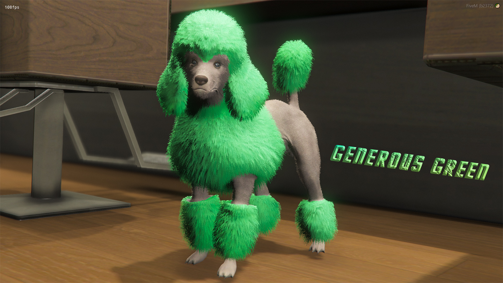
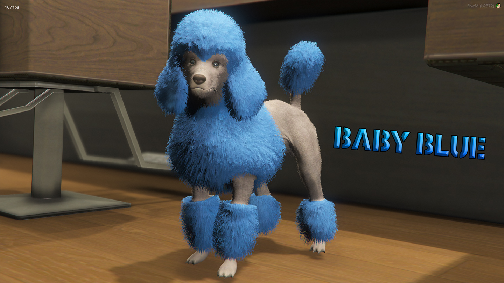
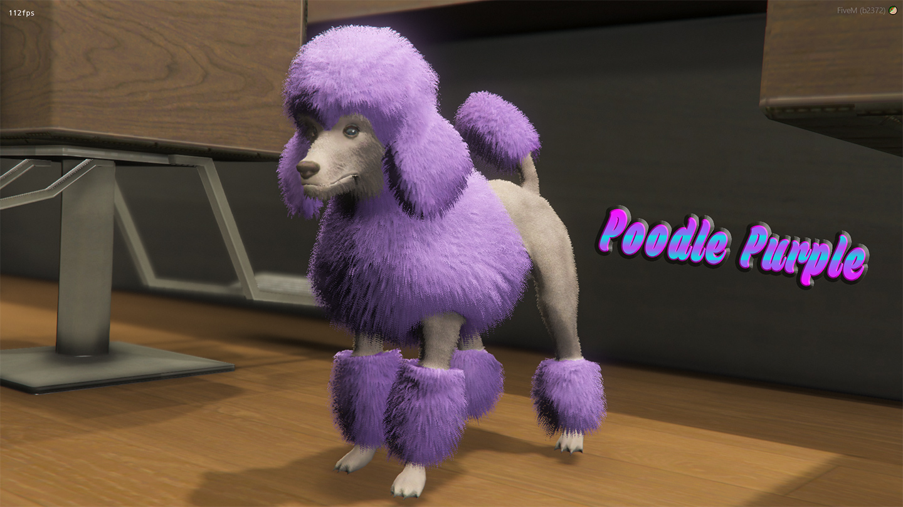
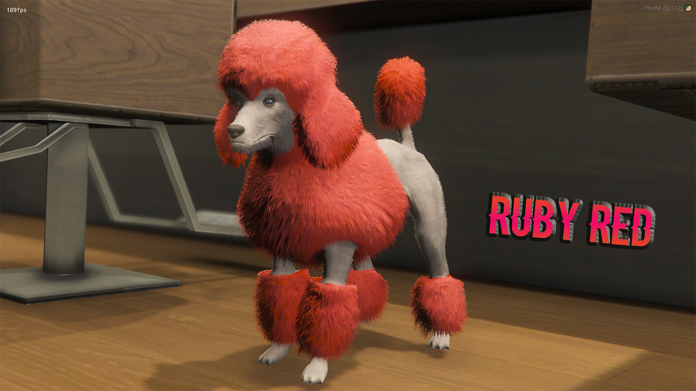
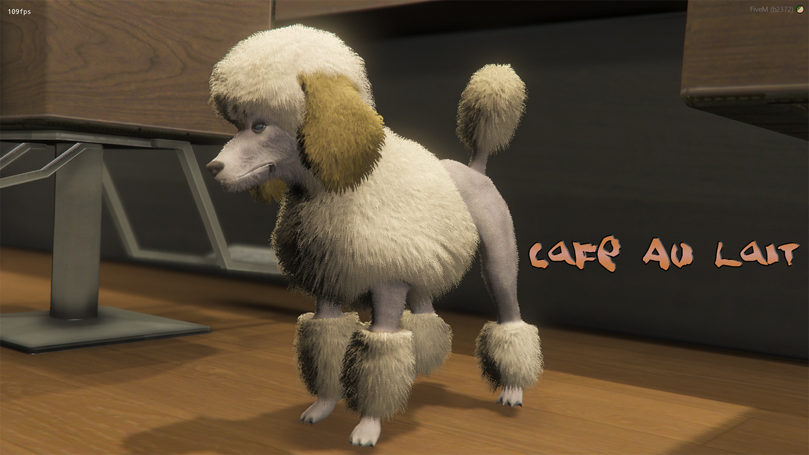
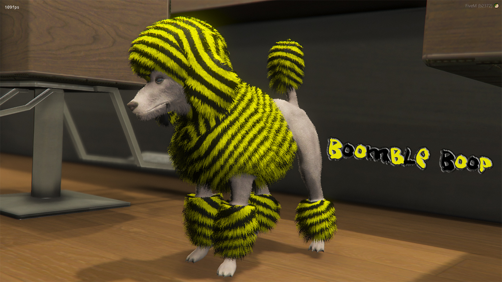

# Coloured Poodles for Single Player and FiveM 🐩

You wouldn't be caught dead with a hat or purse that didn't match the colour of your aura, so why settle for less with any other accessory, like a poodle? Now available in a variety of colours, from the classic white to an unnaturally fashionable pink.

| | | |
|-|-|-|
|  |  |  |
|  |  |  |
|  |  |  |
|  |  |  |
|  |  |  |
|  |  |  |
|  |  |  |

_**Video Preview:**_

# Installing

1. Add to your FiveM resources folder.

2. Add `start Coloured-Poodles` to your server.cfg

# Single Player:

Open OpenIV and Copy x64e.rpf to mods folder

Open OpenIV and go to x64e.rpf > models > cdimages > componentpeds_a_c.rpf > drag the a_c_poodle.ytd and a_c_poodle.ymt files into to componentpeds_a_c.rpf

Start Grand Theft Auto V

Use Menyoo or any trainer and select the poodle ped (a_c_poodle)

Enjoy =)

# Regarding YMT files in FiveM

Coloured Poodles has a modified .ymt file which allows for the Poodle to have more than one texture, because of this, it is important to know that if you have any custom add-on clothing in your server, you may run into game crashes.

Depending on the GTA 5 game build/version you are running, the amount of add-on clothing packs you are able to stream, seems to be as following:

| Game build number | Alias           | Description                           | YMT files |
|------------------:|:----------------|:--------------------------------------|----------:|
|              1604 | mpchristmas2018 | Arena Wars (default FiveM game build) |        14 |
|              2189 | mpheist4        | Cayo Perico Heist                     |         6 |
|              2372 | mptuners        | Tuners DLC                            |         4 |
|              2545 | mpsecurity      | The Contract                          |         2 |

Please take this into consideration before downloading and adding this to your server.

You can read more about limits, add-on clothing YMTs and more, courtesy of DurtyFree, [here](https://github.com/DurtyFree/durty-cloth-tool/wiki/YMT-game-limit-and-crash-issues)

---------------------------------------

# License 

This project does not contain a license, therefore you are not allowed to add one and claim it as yours.

You are not allowed to sell this nor re-distribute it. 

You are not allowed to change/add a license. If you want to modify or make an agreement, you can contact me. 

Pull requests are accepted as long as they do not contain breaking changes. 

You can read more here [HERE](https://opensource.stackexchange.com/questions/1720/what-can-i-assume-if-a-publicly-published-project-has-no-license)
